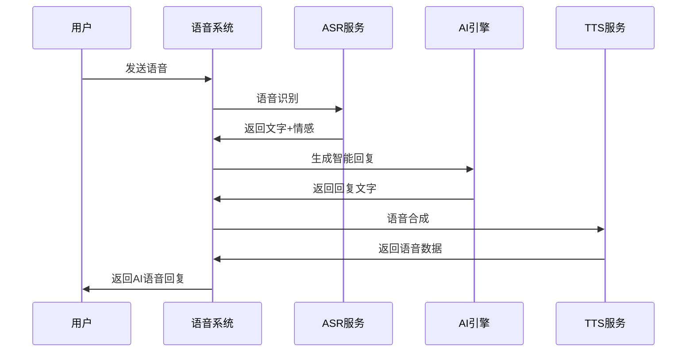

# 🎯 YUNAI AI语音通话系统

## 🌟 系统概览

YUNAI AI语音通话系统是一个完整的、多提供商支持的智能语音交互平台，支持：

- **🎤 语音识别 (ASR)**: 将用户语音转换为文字
- **🔊 语音合成 (TTS)**: 将AI回复转换为语音
- **🎭 音色克隆**: 用户可以克隆自定义音色
- **📞 自动外呼**: AI角色主动联系用户
- **🧠 智能对话**: 基于角色设定、关系网络、聊天记录的智能回复

## 🏗️ 系统架构

```
┌─────────────────────────────────────────────────────────────┐
│                    YUNAI 语音通话系统                        │
├─────────────────────────────────────────────────────────────┤
│  HTTP API Layer                                             │
│  ├── VoiceCallHandler (语音通话接口)                         │
│  └── VoiceProviderHandler (提供商管理接口)                   │
├─────────────────────────────────────────────────────────────┤
│  Service Layer                                              │
│  ├── AIVoiceCallService (AI语音通话服务)                     │
│  ├── VoiceServiceManager (语音服务管理器)                    │
│  └── AutoCallScheduler (自动外呼调度器)                      │
├─────────────────────────────────────────────────────────────┤
│  Adapter Layer (多提供商适配器)                              │
│  ├── SiliconFlowAdapter (SiliconFlow适配器)                 │
│  ├── OpenAIAdapter (OpenAI适配器)                           │
│  ├── AzureAdapter (Azure适配器)                             │
│  ├── ElevenLabsAdapter (ElevenLabs适配器)                   │
│  └── CustomAdapter (自定义适配器)                            │
├─────────────────────────────────────────────────────────────┤
│  Data Layer                                                 │
│  ├── VoiceProvider (语音提供商)                              │
│  ├── VoiceModel (语音模型)                                   │
│  ├── VoiceTemplate (音色模板)                                │
│  ├── CustomVoice (自定义音色)                                │
│  ├── VoiceCallSession (通话会话)                             │
│  └── VoiceMessage (语音消息)                                 │
└─────────────────────────────────────────────────────────────┘
```

## 🚀 核心功能

### 1. **多提供商支持**

系统支持多个语音服务提供商，可以灵活切换和负载均衡：

- **SiliconFlow**: 支持CosyVoice2、SenseVoice等模型
- **OpenAI**: 支持Whisper、TTS-1等模型
- **Azure**: 支持Azure语音服务
- **ElevenLabs**: 专业音色克隆服务
- **自定义**: 支持任意API格式的提供商

### 2. **智能语音对话**



### 3. **音色克隆系统**

用户可以上传音频样本，系统自动克隆音色：

- **上传音频**: 支持多种音频格式
- **自动处理**: 提取音色特征
- **个性化管理**: 用户友好的音色管理界面
- **一键使用**: 在角色创建时直接选择

### 4. **自动外呼功能**

AI角色会在以下情况主动联系用户：

- **长时间未活跃**: 超过3天没有聊天
- **特殊事件**: 生日、节假日等
- **定时提醒**: 用户设定的提醒时间
- **情感支持**: 检测到用户需要关怀

## 📋 API接口

### 语音通话接口

```http
POST /api/voice/call
Content-Type: multipart/form-data

user_id: string (必需)
character_id: string (必需)
session_id: string (可选)
audio: file (必需)
```

### 自动外呼接口

```http
POST /api/voice/auto-call
Content-Type: application/json

{
  "user_id": "string",
  "character_id": "string", 
  "reason": "long_inactive|special_event|scheduled_reminder|emotional_support",
  "context": "string"
}
```

### 音色克隆接口

```http
POST /api/voice/clone
Content-Type: multipart/form-data

user_id: string (必需)
provider_id: string (必需)
voice_name: string (必需)
reference_text: string (必需)
cover_image: string (可选)
audio: file (必需)
```

## 🎨 前端集成示例

### 语音通话组件

```javascript
// 语音通话组件
class VoiceCallComponent {
  constructor(userId, characterId) {
    this.userId = userId;
    this.characterId = characterId;
    this.sessionId = null;
    this.mediaRecorder = null;
    this.audioChunks = [];
  }

  // 开始录音
  async startRecording() {
    const stream = await navigator.mediaDevices.getUserMedia({ audio: true });
    this.mediaRecorder = new MediaRecorder(stream);
    
    this.mediaRecorder.ondataavailable = (event) => {
      this.audioChunks.push(event.data);
    };
    
    this.mediaRecorder.onstop = () => {
      this.sendVoiceMessage();
    };
    
    this.mediaRecorder.start();
  }

  // 停止录音
  stopRecording() {
    if (this.mediaRecorder && this.mediaRecorder.state === 'recording') {
      this.mediaRecorder.stop();
    }
  }

  // 发送语音消息
  async sendVoiceMessage() {
    const audioBlob = new Blob(this.audioChunks, { type: 'audio/wav' });
    const formData = new FormData();
    
    formData.append('user_id', this.userId);
    formData.append('character_id', this.characterId);
    formData.append('audio', audioBlob, 'voice.wav');
    
    if (this.sessionId) {
      formData.append('session_id', this.sessionId);
    }

    try {
      const response = await fetch('/api/voice/call', {
        method: 'POST',
        body: formData
      });
      
      const result = await response.json();
      
      if (result.session_id) {
        this.sessionId = result.session_id;
      }
      
      // 播放AI回复的语音
      this.playAudioResponse(result.audio_url);
      
      // 显示文字回复
      this.displayTextResponse(result.response_text);
      
    } catch (error) {
      console.error('语音通话失败:', error);
    }
    
    // 清空音频缓存
    this.audioChunks = [];
  }

  // 播放AI语音回复
  playAudioResponse(audioUrl) {
    const audio = new Audio(audioUrl);
    audio.play();
  }

  // 显示文字回复
  displayTextResponse(text) {
    const messageDiv = document.createElement('div');
    messageDiv.className = 'ai-message';
    messageDiv.textContent = text;
    document.getElementById('chat-messages').appendChild(messageDiv);
  }
}
```

### 音色克隆组件

```javascript
// 音色克隆组件
class VoiceCloneComponent {
  constructor(userId) {
    this.userId = userId;
  }

  // 克隆音色
  async cloneVoice(voiceName, referenceText, audioFile, coverImage) {
    const formData = new FormData();
    
    formData.append('user_id', this.userId);
    formData.append('provider_id', 'siliconflow'); // 默认使用SiliconFlow
    formData.append('voice_name', voiceName);
    formData.append('reference_text', referenceText);
    formData.append('audio', audioFile);
    
    if (coverImage) {
      formData.append('cover_image', coverImage);
    }

    try {
      const response = await fetch('/api/voice/clone', {
        method: 'POST',
        body: formData
      });
      
      const result = await response.json();
      
      if (result.success) {
        console.log('音色克隆成功:', result.voice_id);
        return result;
      } else {
        throw new Error(result.message);
      }
      
    } catch (error) {
      console.error('音色克隆失败:', error);
      throw error;
    }
  }

  // 获取用户的自定义音色列表
  async getUserVoices() {
    try {
      const response = await fetch(`/api/voice/user/${this.userId}/voices`);
      return await response.json();
    } catch (error) {
      console.error('获取音色列表失败:', error);
      return [];
    }
  }
}
```

## 🔧 配置示例

### 提供商配置

```json
{
  "providers": [
    {
      "name": "siliconflow",
      "display_name": "SiliconFlow",
      "type": "both",
      "base_url": "https://api.siliconflow.cn/v1",
      "api_key": "your-api-key",
      "priority": 100,
      "config": {
        "timeout": 30,
        "retry_count": 3,
        "capabilities": {
          "tts": true,
          "asr": true,
          "voice_clone": true,
          "emotions": ["neutral", "happy", "sad", "angry", "excited"],
          "languages": ["zh-CN", "en-US", "ja-JP", "ko-KR"],
          "audio_formats": ["mp3", "wav", "opus"]
        }
      }
    }
  ]
}
```

### 模型配置

```json
{
  "models": [
    {
      "provider_id": "siliconflow",
      "model_key": "FunAudioLLM/CosyVoice2-0.5B",
      "display_name": "CosyVoice2 0.5B",
      "type": "tts",
      "weight": 95,
      "capabilities": ["tts", "voice_clone", "emotion_control"],
      "pricing": {
        "input_token_price": 0.0001,
        "unit": "1k_tokens",
        "currency": "CNY"
      }
    },
    {
      "provider_id": "siliconflow", 
      "model_key": "FunAudioLLM/SenseVoiceSmall",
      "display_name": "SenseVoice Small",
      "type": "asr",
      "weight": 90,
      "capabilities": ["asr", "emotion_detection", "language_detection"],
      "pricing": {
        "input_token_price": 0.00005,
        "unit": "1k_tokens", 
        "currency": "CNY"
      }
    }
  ]
}
```

## 🎉 总结

YUNAI AI语音通话系统提供了：

- ✅ **完整的语音交互能力** (ASR + TTS + 音色克隆)
- ✅ **多提供商支持** (SiliconFlow, OpenAI, Azure等)
- ✅ **智能对话引擎** (基于角色、关系、历史)
- ✅ **自动外呼功能** (主动关怀用户)
- ✅ **企业级架构** (可扩展、高可用)
- ✅ **用户友好界面** (简单易用的API)

**现在YUNAI拥有了业界领先的AI语音通话能力！** 🚀
