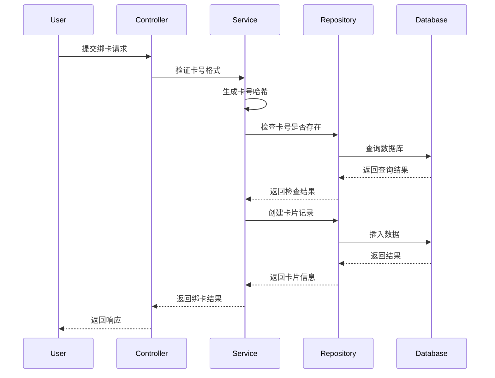
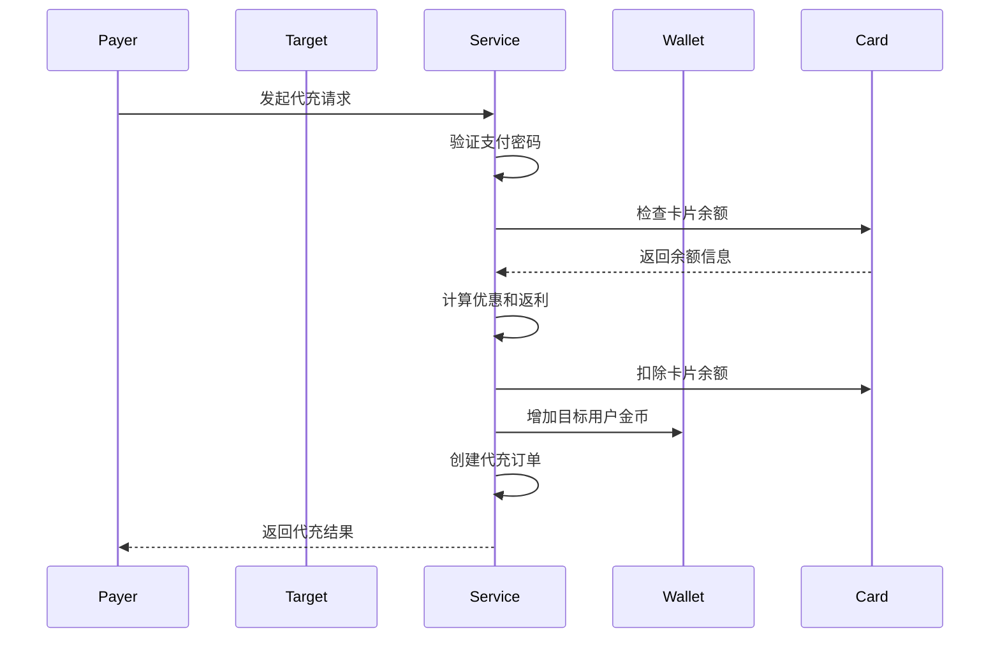

# YUNAI 支付系统模块设计

## 文档信息
- **文档名称**: YUNAI 支付系统模块设计
- **版本**: v1.0
- **创建时间**: 2025-08-26
- **作者**: 小云
- **更新时间**: 2025-08-26

## 模块概述

YUNAI 支付系统是平台的核心模块之一，负责处理所有与支付相关的业务逻辑，包括卡片管理、充值订单、代充功能、钱包管理等。

### 核心功能
- 🏦 多类型卡片管理
- 💳 卡片余额管理
- 🔄 充值订单处理
- 🎁 代充功能
- 💰 钱包金币管理
- 🔐 支付安全验证

## 模块架构

### 分层架构
```
┌─────────────────────────────────────────────────────────┐
│                    Controller Layer                     │
│  ┌─────────────┐ ┌─────────────┐ ┌─────────────┐       │
│  │Payment Ctrl │ │ Wallet Ctrl │ │ Card Ctrl   │       │
│  └─────────────┘ └─────────────┘ └─────────────┘       │
├─────────────────────────────────────────────────────────┤
│                    Service Layer                        │
│  ┌─────────────┐ ┌─────────────┐ ┌─────────────┐       │
│  │Payment Svc  │ │ Wallet Svc  │ │ Card Svc    │       │
│  └─────────────┘ └─────────────┘ └─────────────┘       │
├─────────────────────────────────────────────────────────┤
│                  Repository Layer                       │
│  ┌─────────────┐ ┌─────────────┐ ┌─────────────┐       │
│  │Payment Repo │ │ Wallet Repo │ │ Card Repo   │       │
│  └─────────────┘ └─────────────┘ └─────────────┘       │
├─────────────────────────────────────────────────────────┤
│                    Domain Layer                         │
│  ┌─────────────┐ ┌─────────────┐ ┌─────────────┐       │
│  │Payment Model│ │ Wallet Model│ │ Card Model  │       │
│  └─────────────┘ └─────────────┘ └─────────────┘       │
└─────────────────────────────────────────────────────────┘
```

## 核心组件设计

### 1. 卡片管理组件 (Card Management)

#### 功能职责
- 卡片绑定和验证
- 卡片余额管理
- 卡片状态控制（冻结/解冻/删除）
- 卡片类型识别和优惠计算

#### 核心类设计
```go
type PaymentCard struct {
    ID             uuid.UUID
    UserID         uuid.UUID
    CardNumber     string    // 脱敏显示
    CardNumberHash string    // 哈希存储
    BankName       string
    Balance        float64   // 卡片余额（金额）
    Currency       string    // 货币类型
    IsDefault      bool
    IsActive       bool
    IsFrozen       bool
    BoundEmail     *string   // 绑定邮箱
    CreatedAt      time.Time
    UpdatedAt      time.Time
}

type CardService interface {
    BindCard(ctx context.Context, userID uuid.UUID, req *BindCardRequest) (*PaymentCard, error)
    GetUserCards(ctx context.Context, userID uuid.UUID) ([]*PaymentCard, error)
    RechargeCard(ctx context.Context, userID uuid.UUID, req *CardRechargeRequest) error
    FreezeCard(ctx context.Context, userID uuid.UUID, req *FreezeCardRequest) error
    UnfreezeCard(ctx context.Context, userID uuid.UUID, req *UnfreezeCardRequest) error
    DeleteCard(ctx context.Context, userID uuid.UUID, req *DeleteCardRequest) error
}
```

#### 卡片类型系统
```go
type YunaiCardType struct {
    Code         string   // 卡片代码
    Name         string   // 卡片名称
    Prefix       string   // 卡号前缀
    DiscountRate float64  // 折扣率
    BonusRate    float64  // 返利率
    Privileges   []string // 特权列表
    Color        string   // 显示颜色
    Icon         string   // 显示图标
}

// 支持的卡片类型
var CardTypes = []YunaiCardType{
    {Code: "standard", Name: "标准卡", Prefix: "88", ...},
    {Code: "discount", Name: "折扣卡", Prefix: "89", DiscountRate: 0.9, ...},
    {Code: "bonus", Name: "返利卡", Prefix: "87", BonusRate: 0.2, ...},
    {Code: "vip", Name: "VIP卡", Prefix: "86", DiscountRate: 0.8, BonusRate: 0.1, ...},
    // ...
}
```

### 2. 充值订单组件 (Recharge Order)

#### 功能职责
- 充值订单创建和管理
- 支付处理和验证
- 优惠计算和应用
- 订单状态跟踪

#### 核心类设计
```go
type RechargeOrder struct {
    ID             uuid.UUID
    UserID         uuid.UUID
    OrderNo        string
    Amount         float64   // 实际支付金额
    CoinsAmount    int64     // 基础金币数量
    OriginalAmount float64   // 原始金额
    DiscountAmount float64   // 折扣金额
    BonusCoins     int64     // 返利金币
    PaymentCardID  *uuid.UUID
    Status         string
    PaymentStatus  string
    CreatedAt      time.Time
    ExpiredAt      *time.Time
}

type RechargeService interface {
    CreateOrder(ctx context.Context, userID uuid.UUID, req *CreateRechargeOrderRequest) (*PaymentOrderResponse, error)
    ProcessPayment(ctx context.Context, orderID uuid.UUID, password string) error
    GetOrder(ctx context.Context, userID uuid.UUID, orderID uuid.UUID) (*RechargeOrder, error)
}
```

### 3. 代充功能组件 (Proxy Recharge)

#### 功能职责
- 代充订单处理
- 跨用户资金转移
- 返利计算和发放
- 代充记录管理

#### 核心类设计
```go
type ProxyRechargeOrder struct {
    ID             uuid.UUID
    OrderNo        string
    PayerUserID    uuid.UUID  // 付款人
    TargetUserID   uuid.UUID  // 目标用户
    PaymentCardID  uuid.UUID  // 支付卡片
    OriginalAmount float64    // 原始金额
    ActualAmount   float64    // 实际支付金额
    CoinsAmount    int64      // 基础金币
    BonusCoins     int64      // 返利金币
    TotalCoins     int64      // 总金币
    CardType       string     // 卡片类型
    Message        string     // 代充留言
    Status         string
    CreatedAt      time.Time
}

type ProxyRechargeService interface {
    ProxyRecharge(ctx context.Context, payerUserID uuid.UUID, req *ProxyRechargeRequest) (*ProxyRechargeResponse, error)
    GetProxyOrders(ctx context.Context, userID uuid.UUID, offset, limit int) ([]*ProxyRechargeOrder, error)
}
```

### 4. 钱包管理组件 (Wallet Management)

#### 功能职责
- 用户钱包管理
- 金币余额控制
- 交易记录跟踪
- 限额管理

#### 核心类设计
```go
type Wallet struct {
    ID            uuid.UUID
    UserID        uuid.UUID
    Balance       float64   // 钱包余额（金币）
    Currency      string    // 货币类型
    ExchangeRate  int       // 汇率
    DailyLimit    float64   // 日限额
    MonthlyLimit  float64   // 月限额
    DailySpent    float64   // 日消费
    MonthlySpent  float64   // 月消费
    CreatedAt     time.Time
    UpdatedAt     time.Time
}

type WalletService interface {
    GetWallet(ctx context.Context, userID uuid.UUID) (*Wallet, error)
    AddCoins(ctx context.Context, userID uuid.UUID, amount int64, description string) error
    DeductCoins(ctx context.Context, userID uuid.UUID, amount int64, description string) error
    GetTransactions(ctx context.Context, userID uuid.UUID, offset, limit int) ([]*WalletTransaction, error)
}
```

## 业务流程设计

### 1. 卡片绑定流程


### 2. 代充流程


## 安全设计

### 1. 数据安全
- **卡号加密**: 卡号使用哈希存储，显示时脱敏
- **密码验证**: 支付操作需要支付密码验证
- **邮箱绑定**: 重要操作需要邮箱验证

### 2. 业务安全
- **余额验证**: 严格验证余额充足性
- **状态检查**: 检查卡片和用户状态
- **限额控制**: 实施日/月限额控制

### 3. 接口安全
- **参数验证**: 严格验证所有输入参数
- **权限控制**: 验证用户操作权限
- **频率限制**: 实施接口调用频率限制

## 性能优化

### 1. 数据库优化
- **索引设计**: 为常用查询字段建立索引
- **连接池**: 使用数据库连接池
- **查询优化**: 避免 N+1 查询问题

### 2. 缓存策略
- **用户卡片**: 缓存用户卡片列表
- **汇率配置**: 缓存系统配置信息
- **订单状态**: 缓存订单状态信息

### 3. 并发控制
- **事务管理**: 使用数据库事务确保一致性
- **锁机制**: 对关键操作使用分布式锁
- **异步处理**: 非关键操作异步处理

## 监控和日志

### 1. 业务监控
- 支付成功率
- 代充成功率
- 卡片绑定成功率
- 平均响应时间

### 2. 系统监控
- 数据库连接数
- 内存使用率
- CPU 使用率
- 接口 QPS

### 3. 日志记录
- 所有支付操作日志
- 错误和异常日志
- 性能监控日志
- 安全审计日志

## 扩展性设计

### 1. 卡片类型扩展
- 支持动态添加新的卡片类型
- 灵活的优惠规则配置
- 可配置的特权系统

### 2. 支付方式扩展
- 支持第三方支付接入
- 支持多种货币类型
- 支持国际化支付

### 3. 业务规则扩展
- 可配置的汇率系统
- 灵活的限额规则
- 动态的优惠策略

---

**文档维护**: 本文档由小云维护，模块设计变更需要及时更新此文档。
